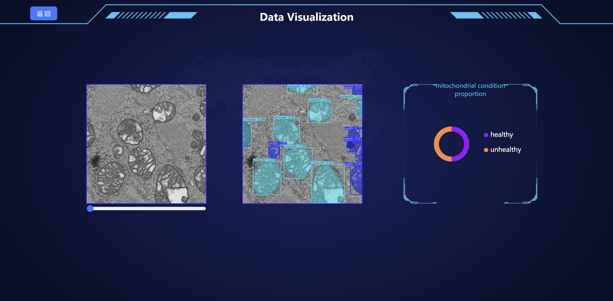
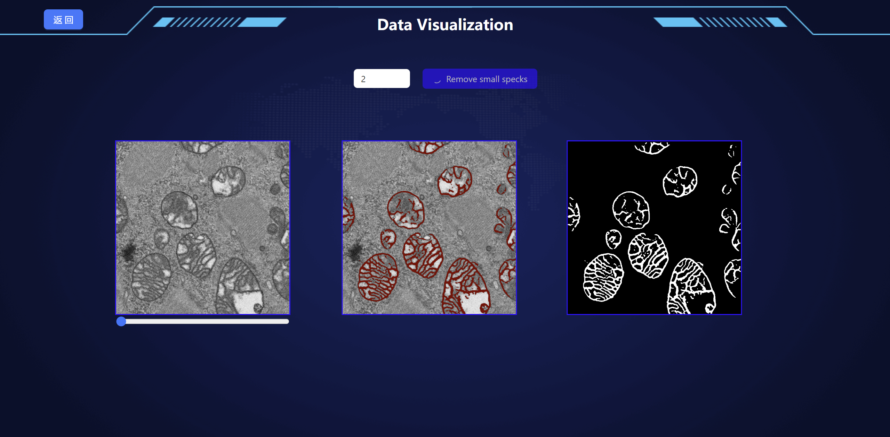
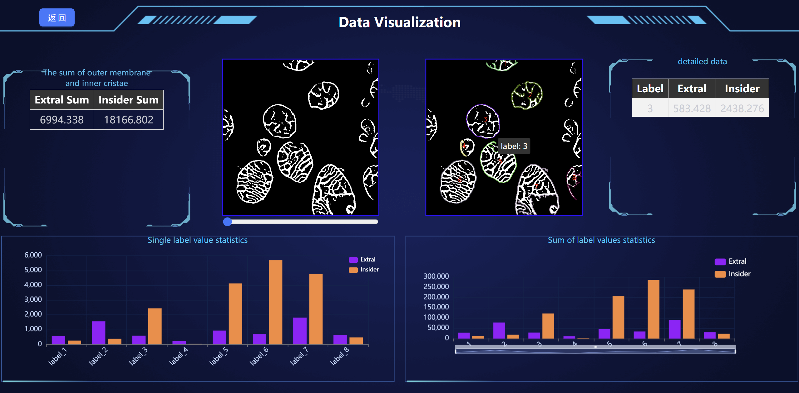

# Segmentation 

> **Authors:**
> [Xinsheng Wang](https://).

## :book:Table Of Contents

- [Update](#update)
- [Installation](#installation)
- [Dataset](#segmentation_data)
- [Pretrained Models](#pretrained_models)
- [GUI](#Usage)
- [Inference](#inference)
- [Citation](#Citation)

## <a name="update"></a>:new:Update

- **2024.08.30**: This repo is released.

## <a name="installation"></a>:gear:Installation

```shell
# clone this repo
git clone https://github.com/xiaohuawan/AMM-Seg.git
cd AMM-Seg

# create environment
conda create -n AMM-Seg python=3.9.19
conda activate AMM-Seg
pip install -r requirements.txt
```

## <a name="segmentation_data"></a>ℹ️Dataset

| Dataset Name | Quark Cloud Disk |
| :---------: | :----------: |
| patient1 | [download](https://pan.quark.cn/s/a42ead7affe3)<br>(pwd: p8FQ) |
| patient2 | [download](https://pan.quark.cn/s/88b45e11fc11)<br>(pwd: dR3a) |
| patient3 | [download](https://pan.quark.cn/s/0153311a7b18)<br>(pwd: KP3P) |

## <a name="pretrained_models"></a>:dna:Pretrained Models

| Model Name | Description |  Quark Cloud Disk |  
| :---------: | :----------: | :----------: |
| patient1.ckpt | AMM-Seg trained on patient1  | [download](https://pan.quark.cn/s/5f233e1f1c78)<br>(pwd: xdJe) |
| patient2.ckpt | AMM-Seg trained on patient2 | [download](https://pan.quark.cn/s/273efdbd0429)<br>(pwd: L82x) |
| patient3.ckpt | AMM-Seg trained on patient3 | [download](https://pan.quark.cn/s/b00e1a8fc24e)<br>(pwd: kpdH) |
| classification.pt | model for evaluating classification | [download](https://pan.quark.cn/s/0ae19c46bb04)<br>(pwd: 7MeU) |

## <a name="inference"></a>:crossed_swords:Inference
    

    python inference.py -model AMM-Seg -c patient1_config


## <a name="train"></a>:stars:Train

<a name="gen_file_list"></a>
1. Generate file list of validation set, a file list looks like:

    ```txt
    /path/to/patient1/data
    /path/to/patient2/data
    /path/to/patient3/data
    ...
    ```

2. Fill in the [training configuration file](/src/config/patient1_config.yaml) with appropriate values.

3. Start training!

    ```shell
    python main.py \
    -c patient1_config
    ```

## <a name="Usage"></a>📽️:GUI

  The system is divided into four main sections: classification assessment, image segmentation, precise calculation. 

1.Usage

- First, open an Administrator Command Prompt and use the `cd` command to navigate to the `AMM-Seg/vite/` directory of your project. Then, type `npm start` to run the project. This will open a browser and navigate to [http://localhost:3000/free](http://localhost:3000/free).

- Next, open a new command prompt and use the `cd` command to navigate to the `AMM-Seg/src/` directory. Then, enter `python app.py`. This will start the backend server running locally at `127.0.0.1:5000`.
  
<p align="center">
     <br />
    <em> 
    Figure 1. Mitochondrial Health Assessment Interface.
    </em>
</p>

<p align="center">
     <br />
    <em> 
    Figure 2. Segmentation of 2D Images Interface.
    </em>
</p>

<p align="center">
     <br />
    <em> 
    Figure 3. Membrane Structure Calculation Interface.
    </em>
</p>

- For detailed usage instructions, please refer to the user manual.

## Citation


  
  
  


